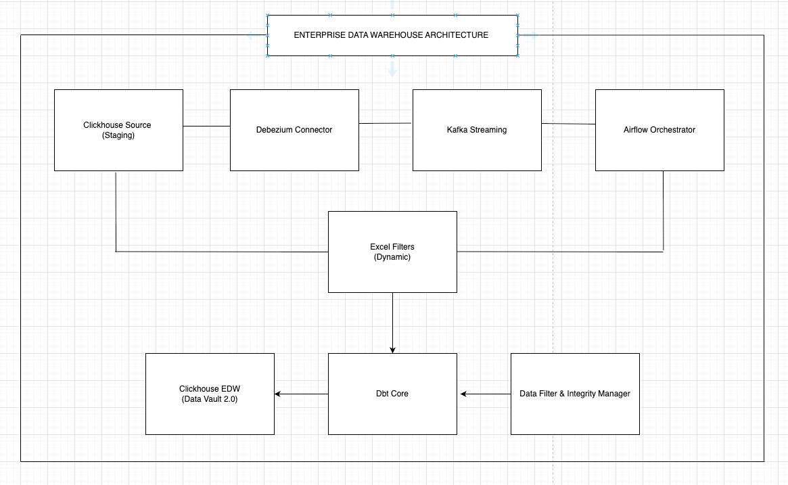

# ClickHouse Enterprise Data Warehouse Project

## Tổng quan

Enterprise Data Warehouse solution sử dụng ClickHouse, Apache Airflow, dbt, và Kafka với phương pháp Data Vault 2.0 cho xử lý dữ liệu thời gian thực và batch processing để tạo ra nguồn dữ liệu thống nhất cho các báo cáo và phân tích kinh doanh. Dự án này bao gồm việc xử lý dữ liệu từ nhiều nguồn khác nhau, áp dụng các business rules thông qua Excel dynamic filters, và cung cấp khả năng mở rộng và hiệu suất cao. Từ nguồn dữ liệu thống nhất EDW đó có thể tạo ra các data marts cho các deal khác nhau phục vụ cho việc phân tích nhanh.

# Phần 1: Giải thích Luồng của Dự án

## 1.1. Kiến trúc Tổng thể




## 1.2. Các Thành phần Chính

### **ClickHouse Source (Staging Database)**
- **Mục đích**: Lưu trữ dữ liệu sản phẩm e-commerce thô
- **Chức năng**: 
  - Chứa bảng `products` với thông tin sản phẩm, giá, doanh thu
  - Materialized View để capture changes cho CDC
  - Bảng `product_changes_log` để ghi lại mọi thay đổi

### **Excel Dynamic Filters**
- **Mục đích**: Định nghĩa business rules cho các deals
- **Cách hoạt động**:
  - Mỗi sheet Excel = 1 deal (Hapas, Obagi, Loreal...)
  - Chứa các điều kiện filter (brand, category, price...)
  - Hỗ trợ operators: EQUALS, CONTAINS, GREATER_THAN, BETWEEN, IN
  - Non-technical users có thể modify business logic

### **Kafka + Debezium CDC**
- **Mục đích**: Real-time change data capture
- **Luồng hoạt động**:
  - Debezium JDBC Connector poll ClickHouse Source mỗi 5 giây
  - Đọc dữ liệu từ `product_changes_log` table
  - Publish CDC events lên Kafka topic `edw_cdc.product_changes_log`
  - Đảm bảo exactly-once delivery

### **Apache Airflow Orchestration**
- **Initial Load DAG**: Xử lý load dữ liệu lần đầu
- **CDC Processing DAG**: Xử lý real-time changes từ Kafka
- **Parallel Processing**: Multi-threading với ThreadPoolExecutor
- **Error Handling**: Retry logic, watermark management

### **dbt Data Transformation**
- **Data Vault 2.0 Modeling**:
  - **Hubs**: Business keys (hub_product, hub_deal)
  - **Links**: Relationships (link_product_deal)
  - **Satellites**: Attributes with history (sat_product_current, sat_product_history)
- **SCD Type 4**: Full historical tracking
- **Incremental Models**: Efficient processing cho CDC data

### **ClickHouse EDW (Data Warehouse)**
- **Mục đích**: Final data warehouse với Data Vault structure
- **Tối ưu**: Partitioning, compression, query performance
- **Tables**: Hub, Link, Satellite tables theo Data Vault 2.0

## 1.3. Luồng Dữ liệu Chi tiết

### **Initial Load Flow**
```
1. Excel Filter Detection
   └── ExcelFilterProcessor đọc deal_filters.xlsx
   └── Phát hiện deals mới (chưa có trong hub_deal)

2. Data Extraction
   └── ClickHouseManager extract data từ Source
   └── Apply filters cho từng deal (1 record có thể thuộc nhiều deals)
   └── Generate Data Vault hash keys

3. Parallel Loading
   └── Split data thành batches
   └── ThreadPoolExecutor parallel insert vào staging
   └── Data Integrity validation & deduplication

4. dbt Transformation
   └── Staging normalization
   └── Hub tables (business keys)
   └── Link tables (relationships)
   └── Satellite tables (attributes + history)
```

### **CDC Flow (Real-time)**
```
1. Change Capture
   └── User updates data trong ClickHouse Source
   └── Materialized View capture thay đổi
   └── Insert vào product_changes_log

2. Debezium Processing
   └── JDBC Connector poll changes mỗi 5s
   └── Generate CDC events với op: c/u/d
   └── Publish lên Kafka topic

3. Kafka Streaming
   └── CDC events được partition theo product_id
   └── Airflow KafkaMessageSensor detect new messages
   └── Trigger CDC processing DAG

4. CDC Processing
   └── Consume messages từ Kafka
   └── Apply Excel filters (dynamic business rules)
   └── Data validation & duplicate detection
   └── Parallel insert vào EDW staging

5. Incremental Transformation
   └── dbt incremental models
   └── Update Hub/Link/Satellite tables
   └── Maintain data lineage & audit trail
```


# Phần 2: Cách Triển khai Dự án

## 2.1. Cài đặt Môi trường

### **Bước 1: Clone Repository**
```bash
# Clone project
git clone 
cd clickhouse-edw-project
```

### **Bước 2: Setup Python Environment**
```bash
# Tạo virtual environment
python3 -m venv venv

# Activate environment
source venv/bin/activate  # Linux/macOS
# hoặc venv\Scripts\activate  # Windows

# Upgrade pip
pip install --upgrade pip

# Install dependencies
pip install -r requirements.txt
```

### **Bước 3: Configuration**
```bash
# Copy và customize environment file
cp .env.example .env
```

## 2.3. Triển khai Infrastructure

### **One-Command Deployment**
```bash
# Full infrastructure deployment
chmod +x scripts/*.sh
./scripts/setup_infrastructure.sh
```
### **Service Access**
- **Airflow UI**: http://localhost:8080 (admin/admin)
- **ClickHouse Source**: http://localhost:8123
- **ClickHouse EDW**: http://localhost:8124
- **Debezium Connect**: http://localhost:8083/connectors

## 2.5. Chạy Pipeline

### **Initial Load Pipeline**

**Step 1: Access Airflow**
```bash
# Open browser
open http://localhost:8080

# Login credentials
Username: admin
Password: admin
```

**Step 2: Trigger Initial Load**
1. Tìm DAG `initial_load_pipeline`
2. Trigger DAG

**Step 3: Verify Results**
```bash
# Check staging data
docker exec clickhouse-edw clickhouse-client --query="
SELECT deal_name, count(*) 
FROM edw.stg_products 
GROUP BY deal_name
"

# Check Data Vault tables
docker exec clickhouse-edw clickhouse-client --query="
SELECT 'hub_product', count(*) FROM edw.hub_product
UNION ALL
SELECT 'hub_deal', count(*) FROM edw.hub_deal  
UNION ALL
SELECT 'link_product_deal', count(*) FROM edw.link_product_deal
"
```

### **CDC Pipeline Testing**

**Step 1: Enable CDC DAG**
1. Trong Airflow UI, enable `cdc_processing_pipeline`
2. DAG sẽ tự động chạy mỗi 5 phút

**Step 2: Test Real-time Changes**
```bash
# Insert new product
docker exec clickhouse-source clickhouse-client --query="
INSERT INTO staging.products VALUES 
(999, 'Test CDC Product', 'Test Description', 'Skincare', 'Hapas', 4.0, 'test.jpg', 'Test Store', 'https://test.com', 1000000.00, '2025-01', 100000.00, 10)
"

# Update existing product
docker exec clickhouse-source clickhouse-client --query="
ALTER TABLE staging.products UPDATE price = 300000.00 WHERE product_base_id = 1
"


# Check CDC logs
docker exec clickhouse-source clickhouse-client --query="
SELECT operation_type, count(*) 
FROM staging.product_changes_log 
GROUP BY operation_type
"
```

## 2.6. Configuration Management

### **Excel Filters Management**

**File Location:** `configs/deal_filters.xlsx`

**Format:**
```
Sheet "Hapas":
| column_name | operator      | value    | logical_operator |
|-------------|---------------|----------|------------------|
| brand       | CONTAINS      | Hapas    | AND              |
| category    | EQUALS        | Skincare | AND              |
| price       | GREATER_THAN  | 100000   | AND              |

Sheet "Obagi":
| column_name | operator | value          | logical_operator |
|-------------|----------|----------------|------------------|
| brand       | CONTAINS | Obagi          | AND              |
| category    | IN       | Skincare,Beauty| AND              |
```

**Thêm Deal Mới:**
1. Tạo sheet mới trong Excel với tên deal
2. Định nghĩa filter conditions
3. Save file Excel
4. Trigger `initial_load_pipeline` để process deal mới

